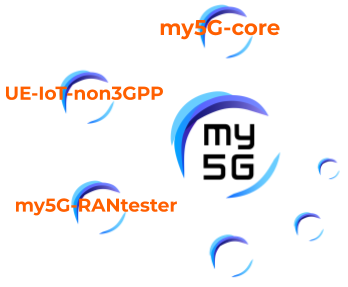

# my5G Initiative

The main objective of the my5G initiative is to make 5G software systems accessible also to non-experts. The initiative is also interested in allowing the use of the software systems in a large variety of scenarios. Finally, my5G initiative has the goal of creating a friendly environment for students, researchers and practitioners to learn about and contribute to 5G software systems.

     

Currently, the main project under the my5G initiative are:
* [my5G-core](https://github.com/my5G/my5G-core) - a 5G Standlone core following the 3GPP standards.
* [UE-IoT-nonGPP](https://github.com/my5G/UE-IoT-non3GPP) - virtual UE able to integrate IoT non3GPP devices (e.g., LoRa) to 5G networks. 
* [my5G-RANtester](https://github.com/my5G/my5G-RANtester) - an NGAP tester that can emulate UEs and gNBs.
