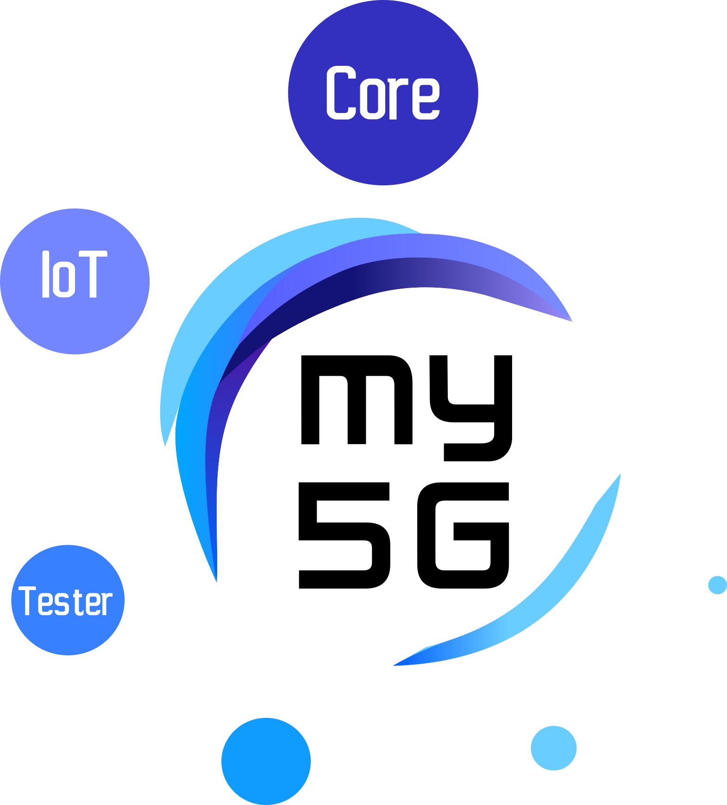
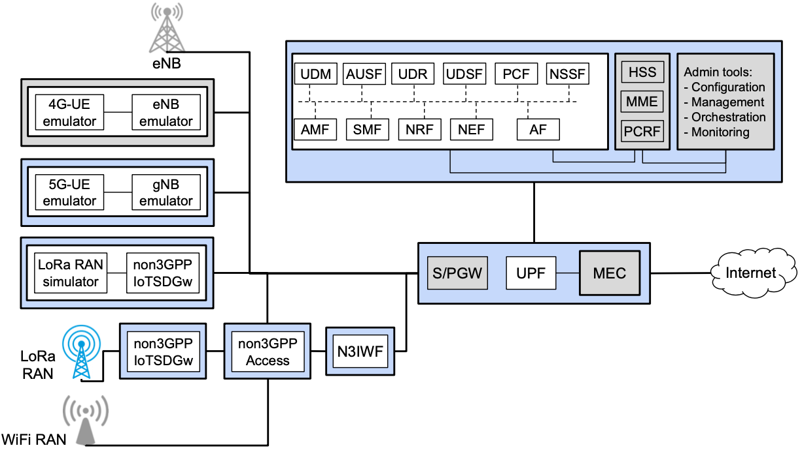

# my5G Initiative

The main objective of the my5G initiative is to make 5G software systems accessible also to non-experts. Moreover, the initiative is interested in allowing the use of software systems in a large variety of scenarios. Finally, my5G initiative aims to create a friendly environment for students, researchers, and practitioners to learn about and contribute to 5G software systems.

     

The my5G initiative's development ecosystem comprises a virtual environment, i.e., virtual machines and containers. This environment can integrate a physical network (e.g., Software-Defined Radio - SDR) or operate only in an emulated mode. For example, the figure below shows some initiatives for the development of software involving the 5G core, Multi-access Edge Computing (MEC), 4G integrated, New-Generation Radio Access Network (NG-RAN), and non-3GPP (e.g., LoRa-RAN and WiFi-RAN).

     

Currently, the main project under the my5G initiative are:
* [my5G-core](https://github.com/my5G/my5G-core) - a 5G Standlone core following the 3GPP standards.
* [UE-IoT-non3GPP](https://github.com/my5G/UE-IoT-non3GPP) - virtual UE able to integrate IoT non3GPP devices (e.g., LoRa) to 5G networks. 
* [my5G-RANtester](https://github.com/my5G/my5G-RANtester) - an NGAP tester that can emulate UEs and gNBs.

## Additional information

* [IEEE NetSoft tutorial - 2020](https://github.com/LABORA-INF-UFG/NetSoft2020-Tutorial4) - This tutorial aims to explore the softwarization in the 5G system.
* [SBrT'2020 course - 2020](https://github.com/LABORA-INF-UFG/SBrT2020-Minicurso1) - This course explores 5GC internals through an open-source implementation.
